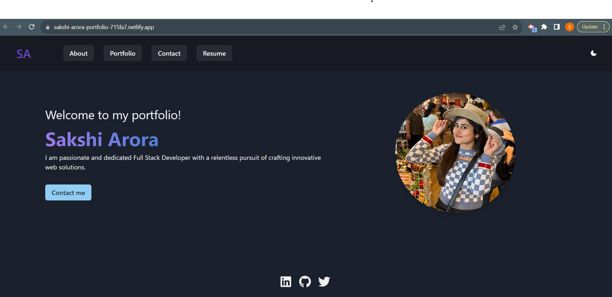

# React_Portfolio

## Description 

As a full-stack developer, I'm passionate about crafting seamless, end-to-end web solutions that deliver exceptional user experiences and robust functionality. Here, you'll find a curated selection of projects that reflect my skills, creativity, and dedication to the art of web development.

Check out my responsive portfolio built with React. This website features mobile-friendly design and easy navigation between components.

## Table of Contents
* [Live Demo](#live-demo)
* [Installation](#installation)
* [Features](#features)
* [Technologies](#technologies)
* [Credits](#credits)
* [Contact Information](#contact-information)

## Live Demo

Check out the live demo of my portfolio [here](https://sakshi-arora-portfolio-715fa7.netlify.app/).

### Preview

- HomePage


- Demo Video


## Installation 

To run this project locally, follow these steps:

-  Clone the repository from GitHub
- Open the terminal and navigate to root directory. Install required dependencies given in package.json by running command:

   ```
   npm install
   ```
- Run `npm start` to start the application

## Features

My personal portfolio which features some of my github projects as well as my resume and technical skills.

- **Responsive Design:** The portfolio design is fully responsive, ensuring it looks great on various screen sizes, from desktop to mobile devices.

- **Modular Components:** The design is organized into modular React components, making it easy to customize and extend.

- **Interactive Elements:** Includes interactive elements like smooth scrolling navigation.

- **Contact Form:** An example contact form is included, allowing users to reach out to you directly.

## Technologies

1. React.js
2. React Router
3. Chakra UI
4. Javascript
5. Vite

## Credits

References:

https://chakra-templates.dev/navigation/

https://stackoverflow.com/questions/38980051/reactjs-adding-active-class-to-button

## Contact Information

Github Username: [sakshiarora04](https://github.com/sakshiarora04)

Email id: sakshiarora245@gmail.com
